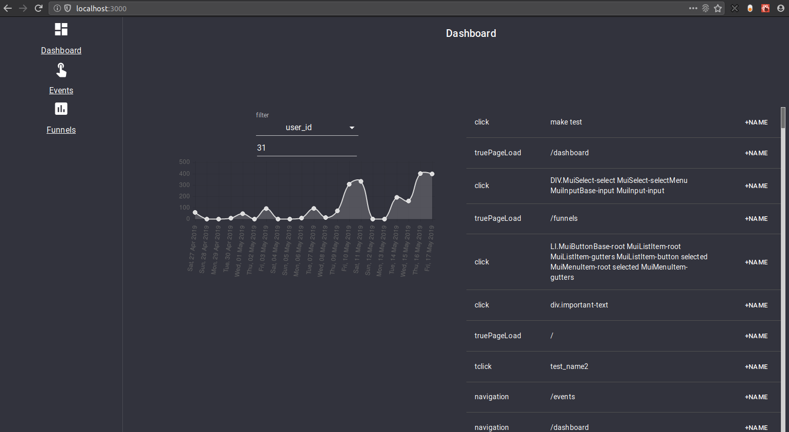

Abacus
======

Website analytics platform prototype.

The basic idea is you can add some javascript to your site, causing all clicks
/ pageloads / navigation / form submits to log an event.
(see `frontend/src/client/inject.js`) We keep track of the events, and expose
them via a dashboard.

The dashboard allows you to graph event frequency over time, name events, and
filter them.

Again, this is very much a prototype.  I took basically all the shortcuts I
could think of, and took on as much technical debt as the banks would let me.
Please lower your expectations.

Assumptions
-----------

  - code lives in `~/code/abacus`
  - You have Postgres >= 10.8 installed, and running with the appropriate
    user/password/port/..
    + See `config.json`
  - Python >= 2.7+
  - Virtualenv >= 16.1.0

Installation
------------

  - `make clean`
  - `make deps`
  - `make api_debug`
  - `cd frontend && npm start`
  - `firefox http://localhost:3000`
